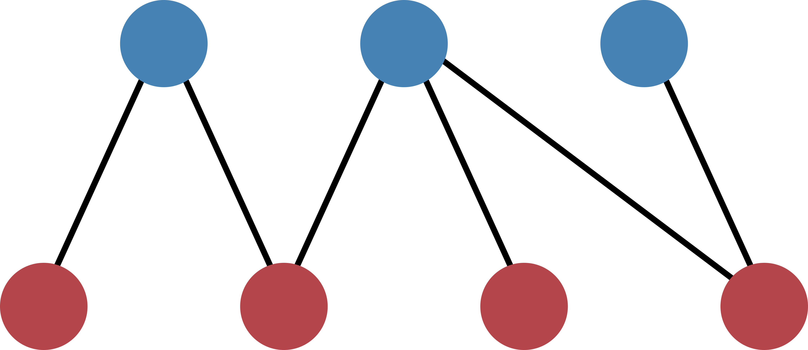
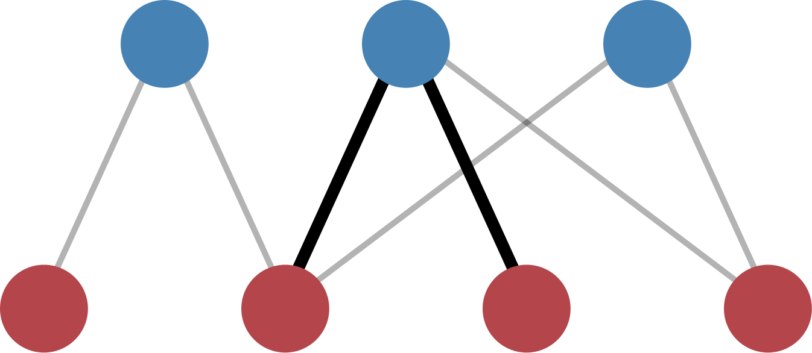

.. _tutorial:

Tutorial
========

The tutorial will take you step by step from the biadjacency matrix of a real-data network to the calculation of the p-values. Our example bipartite network will be the following:

    Figure 1: Example network.

The structure of the network can be captured in a `biadjacency matrix
<https://en.wikipedia.org/w/index.php?title=Adjacency_matrix&oldid=751840428#Adjacency_matrix_of_a_bipartite_graph>`_.
In our case, the matrix is

.. math::
    \left[
    \begin{matrix}
        1 & 1 & 0 & 0 \\
        0 & 1 & 1 & 1 \\
        0 & 1 & 0 & 1
    \end{matrix}
    \right]

Note that the nodes of the layers of the bipartite network are ordered along
the rows and the columns, respectively. In the algorithms, the two layers are
identified by the boolean values ``True`` for the **row-nodes** and ``False`` for
the **column-nodes**. In our example image, the row-nodes are colored in blue
(``True``, top layer) and the column-nodes in red (``False``, bottom layer).

Let's get started by importing the necessary modules::

    >>> import numpy
    >>> from src.bicm import BiCM

The biadjacency matrix of our toy network will be saved in the two-dimensional
NumPy array ``mat``

.. code::

    >>> mat = np.array([[1, 1, 0, 0], [0, 1, 1, 1], [0, 1, 0, 1]])

and we initialize the Bipartite Configuration Model with::

    >>> cm = BiCM(bin_mat=mat)

Biadjacency matrix
--------------------------------------------------------------------------------

In order to obtain the biadjacency matrix of the BiCM null model corresponding
to the input network, a number of equations have to be solved. This is
done automatically by running

.. code::

    >>> cm.make_bicm()

In our example graph, the BiCM biadjacency matrix should be::

    >>> cm.adj_matrix
    array([[ 0.21602144,  0.99855239,  0.21602144,  0.56873952],
           [ 0.56845256,  0.99969684,  0.56845256,  0.86309703],
           [ 0.21602144,  0.99855239,  0.21602144,  0.56873952]])

If necessary, we could now save the matrix in the file *<filename>* with

.. code::

    >>> cm.save_biadjacency(filename=<filename>, delim='\t')

Note that the default delimiter is ``\t`` and does not have to be specified.
Other delimiters such as ``,`` or ``;`` work fine as well. The matrix can
either be saved as a human-readable ``.csv`` or as a binary NumPy ``.npy``
file, see :func:`save_biadjacency` in the :ref:`api`. In the latter case, we
would run::

    >>> cm.save_biadjacency(filename=<filename>, binary=True)

If ``binary == True``, the file ending ``.npy`` is appended automatically.

.. note::

    The function ``make_bicm`` relies on the ``scipy.root`` routine, which uses a specified numerial solver to solve a system of equation. If the solver does not find a solution, on may run the function with ``method`` and ``initial_conditions`` arguments::

        >>> cm.make_bicm(method=<method_name>, initial_conditions=<initial_guesses>)

    For a list of possible solvers, see the `scipy.optimize.root documentation <https://docs.scipy.org/doc/ scipy-0.19.0/reference/generated/scipy.optimize.root.html>`_.

P-values
--------------------------------------------------------------------------------

Each entry in the biadjacency matrix of the null model corresponds to the
probability of observing a link between the corresponding row- and
column-nodes. If we take two nodes in the same layer, we can count the number
of common neighbors that they share in the original input network and calculate
the probability of observing the same or more common neighbors according to the
BiCM [Saracco2016]_. This corresponds to calculating the p-values for a
right-sided hypothesis testing.

The number of common neighbors can be described in terms of
:math:`\Lambda`-motifs [Saracco2016]_, as shown in Figure 2.

    Figure 2: Illustration of a :math:`\Lambda`-motif between the two central
    red nodes.

The calculation of the p-values is computationally intensive and should be
performed in parallel, see :ref:`parallel` for details. It can be executed by
simply running

.. code::

    >>> cm.lambda_motifs(<bool>, filename=<filename>)

where ``<bool>`` is either ``True`` of ``False`` depending on whether one wants
to address the similarities of the **row-** or **column-nodes**, respectively.
The results are written to *<filename>*. By default, the file is a binary NumPy
file to reduce disk space, and the format suffix ``.npy`` is appended. If the
file should be saved in a human-readable ``.csv`` format, provide an
appropriate name ending with ``.csv`` and use::

    >>> cm.lambda_motifs(<bool>, filename=<filename>, delim='\t', binary=False)

Again the default delimiter is ``\t``.

.. note::

    The p-values are saved as a one-dimensional array with index :math:`k \in
    \left[0, \ldots, \binom{N}{2} - 1\right]` for a bipartite layer of
    :math:`N` nodes. Please check the section :ref:`output-format` for details
    regarding the indexing.

Having calculated the p-values, it is possible to perform a multiple hypothesis
testing of the node similarities and to obtain an unbiased monopartite
projection of the original bipartite network. In the projection, only
statistically significant edges are kept.

For further information on the post-processing and the monopartite projections,
please refer to [Saracco2016]_.

